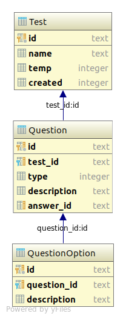

# EvaluApp

> Se requiere una aplicación que permita la generación de pruebas (exámenes, quices), la app debe permitir la creación de pruebas, el usuario determina el número y el tipo de preguntar a incluir en la evaluación (falso verdadero, selección múltiple, completar), una vez ingresadas las preguntas el sistema debe permitir (a los estudiantes la presentación de la prueba), la información del generador de la pruebas, las preguntas y las respuestas deben quedar almacenadas en una base de datos SQLite, en el equipo que genere la prueba, y los resultados deben quedar disponibles en una bd en Firebase (en la nube), de tal manera que los resultados pueden ser consultados por los estudiantes.

## Diagrama de clases

